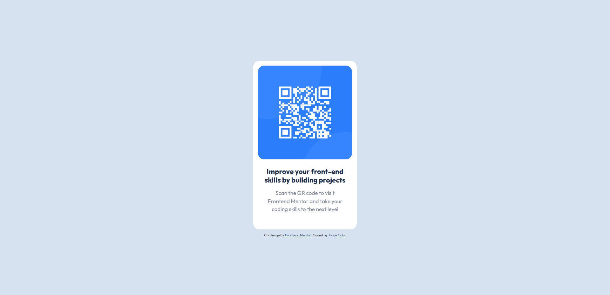

# Frontend Mentor - QR code component solution

This is a solution to the [QR code component challenge on Frontend Mentor](https://www.frontendmentor.io/challenges/qr-code-component-iux_sIO_H). Frontend Mentor challenges help you improve your coding skills by building realistic projects. 

## Overview

### Screenshot

### Links

- Live Site URL: [Add live site URL here](https://jcalor.github.io/qr-code/index)

## My process

### Built with

- Semantic HTML5 markup
- CSS custom properties
- Bootstrap version 4

### Useful resources

- [Google Fonts API](https://developers.google.com/fonts/docs/css2) - This helped me to understand how to use Google Fonts API. It's a bit different than before to implement Google Fonts API on HTML but you can easily implement it reading carefully this documentation.

## Author

- Twitter - [@itsTheGorge](https://twitter.com/itsTheGorge)